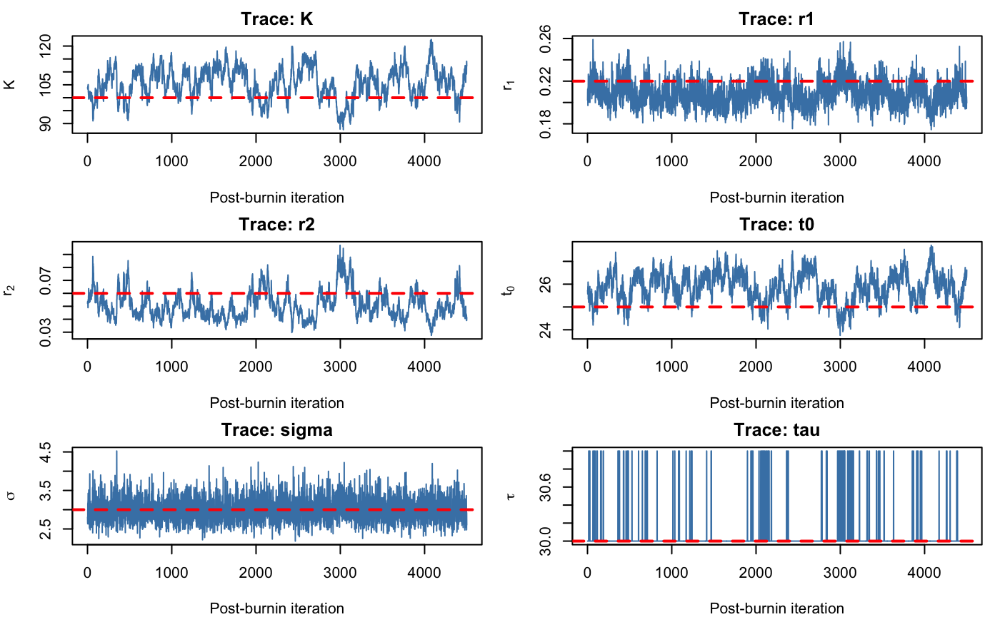
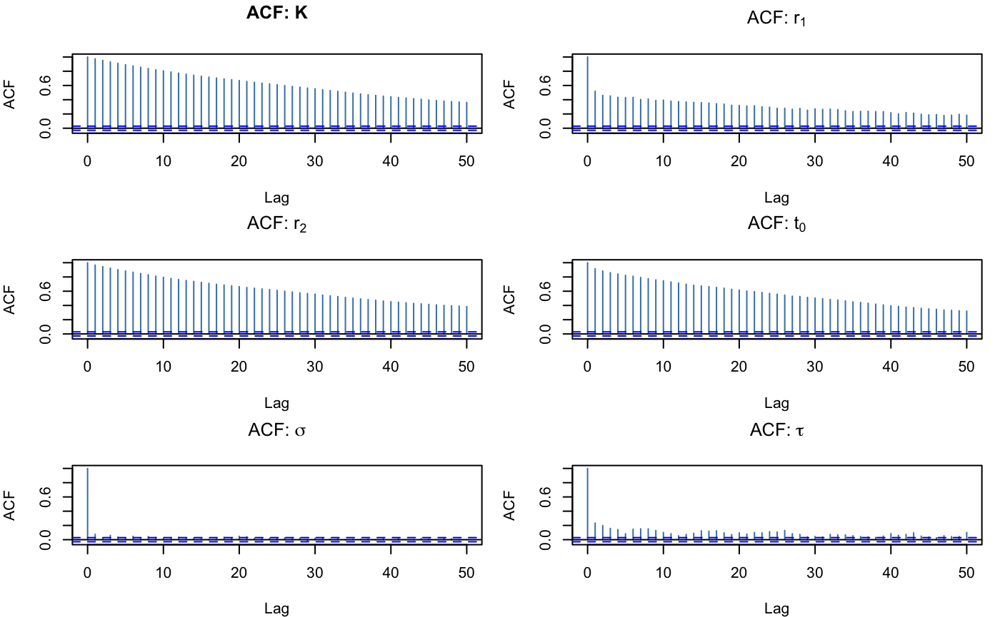
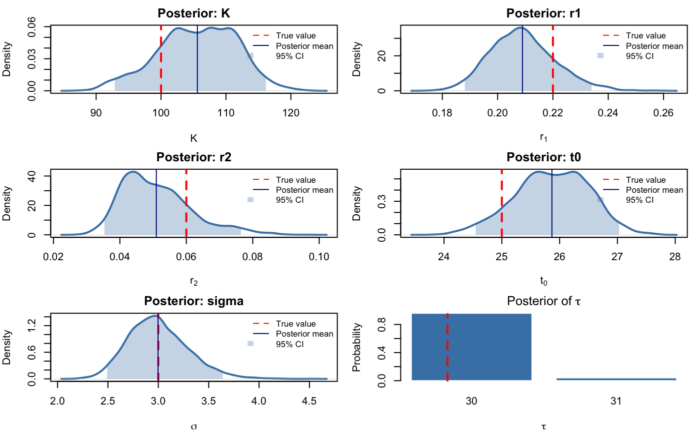
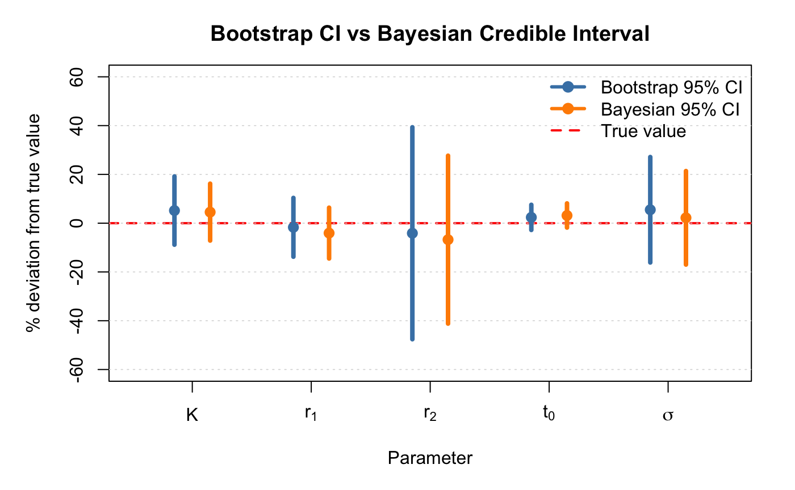
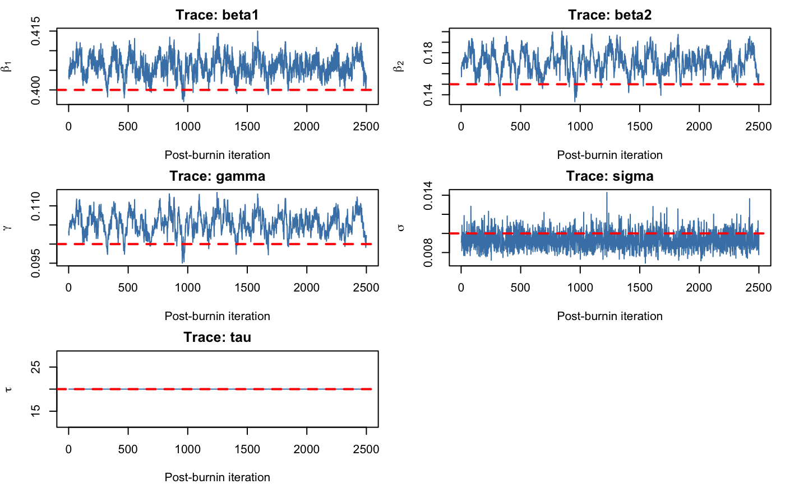
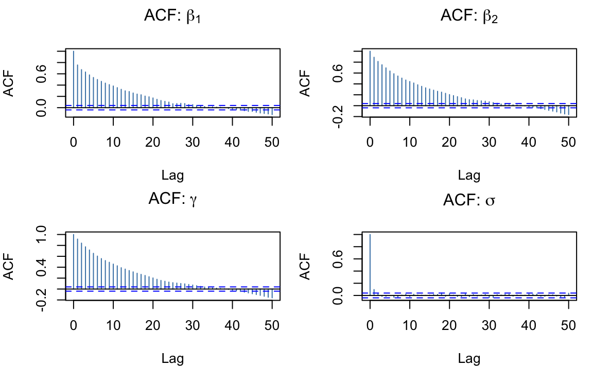
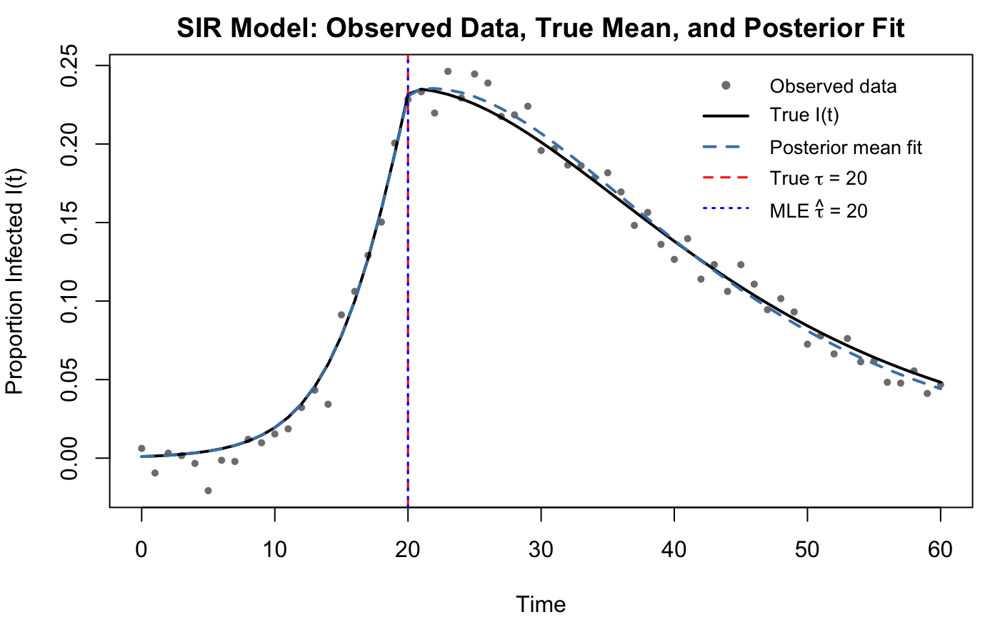
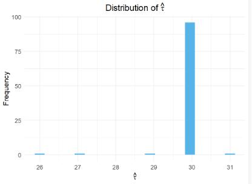
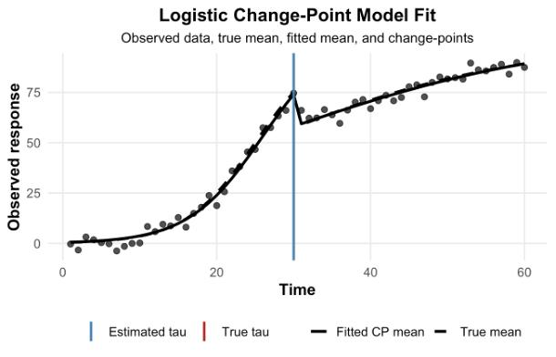
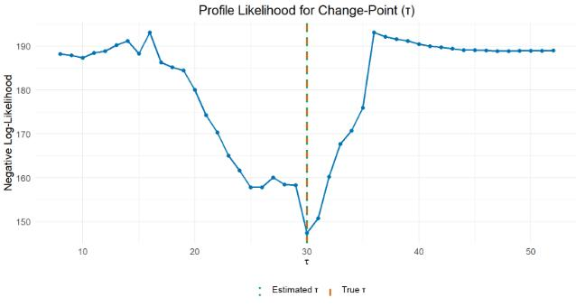

---
format:
  pdf:
    df-print: default
    fig-cap-location: bottom
    fontsize: 9pt
    geometry: margin=1in
  html: default

bibliography: refs.bib

editor:
  markdown:
    wrap: sentence
---

\begin{center}

{\Large \textbf{Change-Point Detection in Logistic and Epidemic Models: Computational and Inferential Consequences}}\\[1.2em]

Dinuwanthi Liyanage, Ovini Kariyawasam, Maksuda Aktar Toma \\[0.8em]
Department of Statistics, University of Nebraska--Lincoln, Lincoln, NE, United States\\[0.8em]

\end{center}

# Abstract

Change-point detection in nonlinear dynamical systems presents fundamental challenges for both statistical inference and computation.  
This project investigates change-point detection in two nonlinear growth models: a logistic growth model and a Susceptible-Infected-Recovered (SIR) epidemic model.  
For each model, we implement maximum likelihood estimation via profile likelihood search, parametric bootstrap, and Bayesian inference via Metropolis-within-Gibbs Markov chain Monte Carlo.  
Simulation studies confirm that both models recover true parameters with negligible bias, and the change-point parameter is estimated with high accuracy under both inferential paradigms.  

A key finding is that change-point identifiability differs fundamentally between the two models.  
In the logistic model, the posterior for $\tau$ spreads across two adjacent values, while in the SIR model it collapses to a point mass at the true value, a consequence of the transmission rate change propagating through the entire coupled ODE system.  
Bootstrap and Bayesian intervals show broadly consistent conclusions in both models, though differences in interval width reflect how each method captures uncertainty and parameter dependence, particularly in the SIR setting.  
Computationally, the SIR model is substantially more expensive, requiring ODE solving at every likelihood evaluation and making estimation significantly slower than in the logistic case.  
These results demonstrate that model mechanistic complexity has direct and quantifiable consequences for both inferential precision and computational cost.
The entire code and details are accessible through this GitHub link: <https://github.com/maksudatoma/Stat-950-Project>

# 1. Introduction

Nonlinear growth processes arise in many scientific fields, including ecology, population dynamics, and epidemiology.
For example, population size often follows a logistic growth pattern, while the spread of infectious diseases is commonly modeled using compartmental systems such as the SIR model [@kermack1927].
In many real-world settings, however, these processes are not stable over time.
External factors such as environmental changes, policy interventions, or behavioral shifts can alter key model parameters, leading to different growth regimes.
Detecting and accounting for such changes is essential for accurate modeling, prediction, and inference.

A natural way to represent such structural changes is through change-point models, where model parameters are allowed to shift at an unknown time point [@killick2012].
In the context of logistic growth, this may correspond to a change in the intrinsic growth rate or carrying capacity.
In epidemic models such as SIR, a change-point may represent an intervention that alters the transmission rate.
The central scientific problem, therefore, is to estimate both the model parameters and the unknown change-point, and to understand how ignoring such regime changes affects inference and uncertainty quantification.

Standard analytical methods are inadequate for this problem for several reasons.
First, nonlinear models such as logistic growth and SIR systems do not generally admit closed-form solutions for parameter estimation under noisy observations [@seber2003].
Second, the presence of an unknown change-point introduces a non-smooth and combinatorial structure into the likelihood function, since the change-point is a discrete parameter while the model parameters are continuous.
This prevents the direct application of classical analytical techniques and complicates both estimation and uncertainty quantification.
Third, in more complex models such as SIR, the mean structure is defined implicitly through systems of differential equations, further increasing computational difficulty [@kermack1927].

This is a computational statistics problem because inference requires the integration of multiple computational techniques, including nonlinear optimization, discrete search over candidate change-points, simulation-based uncertainty quantification, and numerical methods for solving differential equations.
In addition, Bayesian inference relies on posterior computation using Markov chain Monte Carlo (MCMC), as closed-form posterior distributions are not available [@gelman2013].
The complexity of the problem also necessitates careful evaluation of computational performance, including runtime, numerical stability, sensitivity to initialization, and identifiability of the change-point.

In this project, we begin with the logistic growth model as a baseline nonlinear system and develop both frequentist and Bayesian methods for change-point detection.
We then extend the same framework to a simple SIR epidemic model to investigate how the inferential and computational challenges evolve in a more complex, mechanistic setting.
This progression allows us to systematically study the impact of model structure on estimation, uncertainty quantification, and computational behavior.

# 2. Logistic Growth Model

## 2.1 Data-Generating Mechanism

Let $(t_i, y_i)$, for $i = 1, 2, \ldots, n$, denote the observed data, where $t_i$ represents time and $y_i$ is the corresponding response.
We assume that each observation is generated as follows.

### Model 1: Logistic Model (No Change-Point)

The logistic growth model is

$$
y_i = f(t_i; \theta) + \varepsilon_i, \qquad \varepsilon_i \sim N(0, \sigma^2),
$$

with mean function

$$
f(t_i; \theta) = \frac{K}{1 + \exp\{-r(t_i - t_0)\}}.
$$

### Model 2: Logistic Change-Point Model

To allow for a change in growth rate at an unknown time $\tau$, the change-point model is

$$
y_i = f(t_i; \theta) + \varepsilon_i, \qquad \varepsilon_i \sim N(0, \sigma^2),
$$

with piecewise mean function

$$
f(t_i; \theta) =
\begin{cases}
\dfrac{K}{1 + \exp\{-r_1(t_i - t_0)\}}, & t_i \le \tau, \\
\dfrac{K}{1 + \exp\{-r_2(t_i - t_0)\}}, & t_i > \tau.
\end{cases}
$$

**Parameter Interpretation**: The common parameters include $K > 0$, the carrying capacity representing the maximum level of the response; $t_0$, the inflection point corresponding to the time of fastest growth; and $\sigma^2 > 0$, the variance of the measurement error.

The growth parameters consist of $r > 0$, the overall growth rate, as well as $r_1 > 0$ and $r_2 > 0$, which represent the growth rates before and after the change-point, respectively.

The change-point parameter $\tau$ denotes the time at which the growth rate shifts.

**Likelihood Specification**

For the no-change model, under the Gaussian error assumption, the likelihood is

$$
L(\theta; y) = \prod_{i=1}^n \frac{1}{\sqrt{2\pi\sigma^2}}
\exp\left\{-\frac{(y_i - f(t_i; \theta))^2}{2\sigma^2}\right\}.
$$

For the change-point model, the likelihood is

$$
L(\theta; y) = \prod_{i=1}^n \frac{1}{\sqrt{2\pi\sigma^2}}
\exp\left\{-\frac{(y_i - f(t_i; \theta))^2}{2\sigma^2}\right\},
$$

where $f(t_i; \theta)$ is the piecewise logistic mean function defined above.

**Assumptions**

The model assumes logistic growth within each regime, with a single change-point $\tau$ at which the growth rate may shift.
Parameters are constant within each segment, and the observation errors are assumed to be independent and normally distributed with constant variance.
We also assume that the logistic form is correctly specified and that the change is large enough to be identifiable.

## 2.2 Estimation Procedure (Frequentist Approach)

Parameters are estimated by maximum likelihood.
Under the Gaussian error assumption, this is equivalent to minimizing the negative log-likelihood using numerical optimization in R (`optim` with the `L-BFGS-B` algorithm).

For the no-change model, parameters $(K, r, t_0, \sigma)$ are estimated directly.

For the change-point model, the change-point parameter $\tau$ is treated as discrete and estimated via a grid search over candidate values.
For each candidate $\tau$, the remaining parameters $(K, r_1, r_2, t_0, \sigma)$ are estimated using optimization.
The optimal $\tau$ is selected as the value minimizing the negative log-likelihood.
Model comparison between the no-change and change-point models is based on AIC.

### 2.2.1 Simulation Study

A simulation study was conducted to assess the performance of the change-point logistic model.
Data were generated from a logistic model with a true change-point using $n = 60$ observations and true parameter values $K = 100$, $t_0 = 25$, $r_1 = 0.22$, $r_2 = 0.06$, and $\tau = 30$.

For each simulated dataset, both the no-change model and the change-point model were fitted.
This process was repeated for 100 replications.
Performance was evaluated using bias, RMSE, change-point detection accuracy, and the proportion of simulations in which the change-point model was preferred by AIC.

**Table 1: summary of the parameter estimation results across 100 simulation.**

| Parameter | True Value | Mean Estimate |  Bias |  RMSE |
|-----------|-----------:|--------------:|------:|------:|
| $K$       |     100.00 |        100.45 |  0.45 |  6.58 |
| $r_1$     |       0.22 |         0.221 | 0.001 | 0.013 |
| $r_2$     |       0.06 |         0.061 | 0.001 | 0.012 |
| $t_0$     |      25.00 |         25.05 | 0.048 |  0.68 |
| $\tau$    |      30.00 |         29.93 | -0.07 |  0.52 |

The results indicate that all parameters are recovered accurately, with negligible bias for $r_1$, $r_2$, $t_0$, and $\tau$.
The carrying capacity $K$ exhibits a small positive bias, which is minor relative to its scale.

In terms of variability, RMSE values are small for most parameters, indicating high estimation precision.
The largest RMSE is observed for $K$, reflecting the inherent difficulty of estimating the plateau level of a logistic curve.
In contrast, the growth rates and the change-point parameter show low variability.

The model is highly effective at detecting the change-point, as evidenced by the fact that 98% of the estimated $\hat{\tau}$ values fall within $\pm 2$ units of the true value.

Furthermore, the change-point model is preferred over the no-change model in all simulations based on AIC, demonstrating a strong ability to detect structural changes.

**Move the graphs in appendix. Just write lil bit by of giving direrction to see appendix**\[**Fixed**\]

The graphical results support the numerical findings.
The estimated change-point values are concentrated near the true value, the growth-rate estimates are centered close to their targets, and the fitted change-point logistic model closely follows the true mean function.
The profile likelihood also shows a clear minimum near the true change-point, indicating good identifiability.
Supporting plots are provided in appendix.
(@fig-hist; @fig-log)

### 2.2.2 Parametric Bootstrap

To quantify uncertainty in the frequentist framework, a parametric bootstrap was performed based on a fitted change-point model.
Bootstrap datasets were generated from the fitted mean function with Gaussian noise using the estimated error variance.
The change-point model was then refitted to each bootstrap sample, and the resulting parameter estimates were used to construct 95% confidence intervals.

In this study, 200 bootstrap replications were used.
Bootstrap distributions were used to construct 95% confidence intervals for all parameters, including the change-point.

**Bootstrap Results**

**Table 2: Bootstrap 95% confidence intervals.**

| Parameter | Lower |  Upper |
|-----------|------:|-------:|
| $\tau$    | 28.98 |  31.00 |
| $K$       | 92.18 | 115.87 |
| $r_1$     | 0.187 |  0.240 |
| $r_2$     | 0.035 |  0.083 |
| $t_0$     | 24.46 |  26.90 |
| $\sigma$  |  2.29 |   3.44 |

The bootstrap results indicate that all parameters are estimated with good precision.
The confidence interval for the change-point $\tau$ is narrow and centered near the true value, confirming strong identifiability.
The interval for $K$ is wider, reflecting greater uncertainty in estimating the carrying capacity.
The growth rate $r_1$ is estimated more precisely than $r_2$, consistent with the larger number of observations before the change-point.
Overall, the bootstrap results demonstrate that the parameter estimates are stable, with particularly high precision for the change-point.

## 2.3 Bayesian Inference via Markov Chain Monte Carlo

To complement the frequentist estimation procedure, we adopt a Bayesian inferential framework for the change-point logistic model.
Bayesian inference provides a principled approach to uncertainty quantification by characterizing the full posterior distribution of all parameters jointly, rather than relying on asymptotic approximations or resampling.

**Prior Specification**

We specify weakly informative uniform priors for all parameters, reflecting minimal prior knowledge while enforcing biologically meaningful constraints:

$$
K \sim \text{Uniform}(50, 300), \qquad r_1, r_2 \sim \text{Uniform}(0.001, 2),
$$

$$
t_0 \sim \text{Uniform}(1, 60), \qquad \sigma \sim \text{Uniform}(0.1, 20), \qquad \tau \sim \text{Discrete Uniform}(8, 52).
$$

These priors match the parameter bounds used in the MLE procedure, making the two approaches comparable.
With $n = 60$ and a well-identified signal, the likelihood dominates the prior, so the results are not sensitive to the exact bounds.

**Sampling Algorithm**

We use a Metropolis-within-Gibbs sampler, updating one parameter at a time.
Continuous parameters are updated using Gaussian random-walk proposals, while the change-point $\tau$ is updated using a discrete random walk.
Proposal distributions are tuned to achieve acceptance rates of 0.20--0.50.
The sampler is run for 50,000 iterations, with 5,000 burn-in and thinning by 10, yielding 4,500 posterior samples.

### 2.3.1 Bayesian Estimation Results

**Convergence Diagnostics**

**Table 3: Proposal standard deviations and Metropolis acceptance rates for each parameter.**

| Parameter  |     Proposal SD | Acceptance Rate |
|------------|----------------:|----------------:|
| $$K$$      |             4.0 |           0.213 |
| $$r_1$$    |           0.025 |           0.347 |
| $$r_2$$    |           0.008 |           0.223 |
| $$t_0$$    |             1.0 |           0.200 |
| $$\sigma$$ |             0.8 |           0.378 |
| $$\tau$$   | $$\pm\{1, 2\}$$ |           0.016 |

Acceptance rates for all continuous parameters fell within the target range (Table 3).
The discrete parameter $\tau$ had an acceptance rate of 0.016, which is expected given the strong concentration of posterior mass at $\tau = 30$; the chain rarely proposes a move to a different value because the data strongly support the true change-point.

**Table 4: Effective sample sizes (ESS) for each parameter after burn-in and thinning.**

| $$K$$ | $$r_1$$ | $$r_2$$ | $$t_0$$ | $$\sigma$$ | $$\tau$$ |
|------:|--------:|--------:|--------:|-----------:|---------:|
|    46 |     107 |      49 |      54 |       2594 |      387 |

The parameters $\sigma$ and $\tau$ show high ESS, indicating efficient mixing and near-independent samples.
In contrast, $K$, $r_1$, $r_2$, and $t_0$ have lower ESS due to strong posterior dependence.
This arises from the nonlinear logistic structure, where these parameters jointly control the curve shape and induce posterior correlations.
As a result, the component-wise random-walk sampler mixes more slowly, increasing autocorrelation and reducing ESS.

{#fig-trace width="65%"}

@fig-trace shows stationarity with no drift, indicating convergence.
Continuous parameters ($K$, $r_1$, $r_2$, $t_0$, $\sigma$) exhibit typical “fuzzy caterpillar” patterns, suggesting adequate mixing, and the true values lie within the sampled ranges.
The trace for $\tau$ alternates mainly between 30 and 31, reflecting its discrete nature and strong identifiability.

{#fig-acf width="65%"}

@fig-acf shows the ACF plots after thinning.
The parameters $\sigma$ and $\tau$ exhibit rapid decay, indicating efficient mixing, while $K$, $r_1$, $r_2$, and $t_0$ show persistent autocorrelation, reflecting strong posterior dependence.
This is consistent with their lower ESS values compared to $\sigma$ and $\tau$.
Despite this, posterior means and medians remain reliable.

**Posterior Summary**

**Table 5 : Posterior summary: mean, median, and 95% credible intervals for all parameters.**

| Parameter  | True Value | Post. Mean | Post. Median | Lower 95% | Upper 95% |
|------------|-----------:|-----------:|-------------:|----------:|----------:|
| $$\tau$$   |      30.00 |      30.05 |        30.00 |     30.00 |     31.00 |
| $$K$$      |     100.00 |     104.52 |       104.10 |     93.05 |    115.39 |
| $$r_1$$    |      0.220 |      0.213 |        0.213 |     0.191 |     0.235 |
| $$r_2$$    |      0.060 |      0.054 |        0.053 |     0.037 |     0.077 |
| $$t_0$$    |      25.00 |      25.76 |        25.80 |     24.57 |     26.88 |
| $$\sigma$$ |      3.000 |      3.024 |        2.999 |     2.490 |     3.648 |

Posterior means and 95% credible intervals (Table 5) closely recover all true parameter values, indicating accurate estimation.
The change-point $\tau$ is estimated with high precision, with a narrow interval $(30, 31)$ and strong posterior concentration near the true value.
Among the continuous parameters, $K$ shows the greatest uncertainty (widest interval), while $r_1$, $r_2$, $t_0$, and $\sigma$ are estimated more precisely.
Overall, the results demonstrate reliable parameter recovery and well-calibrated uncertainty quantification.

{#fig-post width="65%"}

**Lil bit short write up \[Fixed!\]**

@fig-post shows the marginal posterior distributions for all parameters.
The posterior for $\sigma$ is the most precise and is centered close to the true value.
The posteriors for $r_1$ and $K$ are slightly right-skewed, whereas $r_2$ and $t_0$ are mildly left-skewed, reflecting asymmetry in the likelihood.
All true values fall within the 95% credible intervals, and the posterior for $\tau$ is concentrated mainly at 30 and 31, indicating precise change-point identification.

### 2.3.2 Uncertainty Quantification

**Remove table 6\[Fixed!\]**

{#fig-ci width="65%"}

@fig-ci shows close agreement between the bootstrap and Bayesian intervals for all continuous parameters.
Both methods also estimate the change-point $\tau$ precisely, although the intervals differ slightly because $\tau$ is discrete.
The widest uncertainty is for $K$, while $r_1$ is estimated more precisely than $r_2$.
Overall, the two methods lead to consistent inferential conclusions.

# 3. SIR (Susceptible Infected Recovered) Model

While the logistic growth model captures overall epidemic trends and change-points, it does not explicitly represent transmission dynamics.
To address this, we extend the analysis to the Susceptible–Infected–Recovered (SIR) model, which provides a mechanistic description of disease spread.
In this framework, change-points can be incorporated directly into key parameters such as the transmission rate, allowing for more realistic modelling of interventions and behavioral changes.
The SIR model describes the evolution of susceptible, infected, and recovered populations through a system of differential equations.
Unlike the logistic model, its mean function is not available in closed form and must be computed numerically.

**SIR Change-Point Model**

To allow for structural changes (e.g., interventions), we introduce a change-point $\tau$ in the transmission rate:

$$
\beta =
\begin{cases}
\beta_1, & t \le \tau, \\
\beta_2, & t > \tau.
\end{cases}
$$

The observation model is

$$
y_i = g(t_i; \theta) + \varepsilon_i, \qquad \varepsilon_i \sim N(0, \sigma^2),
$$

with piecewise system of differential equations.

For $t \le \tau$:

$$
\frac{dS(t)}{dt} = -\frac{\beta_1 S(t) I(t)}{N}, \qquad
\frac{dI(t)}{dt} = \frac{\beta_1 S(t) I(t)}{N} - \gamma I(t), \qquad
\frac{dR(t)}{dt} = \gamma I(t).
$$

For $t > \tau$:

$$
\frac{dS(t)}{dt} = -\frac{\beta_2 S(t) I(t)}{N}, \qquad
\frac{dI(t)}{dt} = \frac{\beta_2 S(t) I(t)}{N} - \gamma I(t), \qquad
\frac{dR(t)}{dt} = \gamma I(t).
$$ with mean function $g(t_i; \theta) = I(t_i),$

where $S(t)$, $I(t)$, and $R(t)$ represent the number of susceptible, infected, and recovered individuals at time $t$, respectively, and the system is solved numerically using the appropriate transmission rate before and after the change-point.

**Remove bullet points for the parameter interpretation \[Fixed!\]**

**Parameter Interpretation:** Here, $N$ denotes the total population size, assumed known or fixed, and $\sigma^2 > 0$ is the measurement error variance.
The epidemic parameters are $\beta > 0$, the transmission rate, and $\gamma > 0$, the recovery rate, with $1/\gamma$ representing the average infectious period.
The change-point parameters are $\beta_1 > 0$ and $\beta_2 > 0$, the transmission rates before and after the change-point, respectively, and $\tau$, the time at which the transmission rate changes.

**Assumption:** The model assumes that the total population $N$ is fixed, the initial conditions $S(0)$, $I(0)$, and $R(0)$ are known, and a single change-point occurs in the transmission rate.
Observations are collected at discrete time points and are assumed to have independent Gaussian noise.

## 3.1 Change-Point Estimation and Inference in the SIR Model (Frequentist Approach)

### 3.1.1 Estimation Framework for the SIR Change-Point Model

Parameters of the change-point SIR model are estimated using a frequentist maximum likelihood framework.
Under the assumption of Gaussian observation error, this is equivalent to minimizing the negative log-likelihood.

For a fixed candidate value of the change-point $\tau$, the parameters $(\beta_1, \beta_2, \gamma, \sigma)$ are estimated by minimizing the negative log-likelihood using optim() with the `L-BFGS-B` algorithm in R, where the SIR model is solved numerically via `ode()` from the `deSolve` package at each evaluation.
Since $\tau$ is discrete, it is estimated by a grid search, and the final estimate $\hat{\tau}$ is chosen as the value that gives the smallest negative log-likelihood.

### 3.1.2 Simulation Study

Data were generated from the SIR model for $t = 0,\ldots,60$ with true parameters $\beta_1 = 0.40$, $\beta_2 = 0.15$, $\gamma = 0.10$, and $\tau = 20$, initial conditions $S(0) = 0.999$, $I(0) = 0.001$, $R(0) = 0$, and Gaussian noise with standard deviation $\sigma = 0.01$.

The estimation procedure was applied to each simulated dataset and repeated for 100 replications.
Model performance was evaluated using bias, root mean squared error (RMSE), and change-point estimation accuracy.

**Table 7 : Simulation Performance Metrics**

| Parameter |  True | Mean Estimate |   Bias |   RMSE |
|-----------|------:|--------------:|-------:|-------:|
| $\beta_1$ |  0.40 |        0.4016 | 0.0016 | 0.0093 |
| $\beta_2$ |  0.15 |        0.1531 | 0.0031 | 0.0230 |
| $\gamma$  |  0.10 |        0.1004 | 0.0004 | 0.0061 |
| $\tau$.   | 20.00 |         19.84 |  -0.16 | 0.5477 |

All parameters are estimated accurately, with very small bias and low RMSE.
The transmission rates $\beta_1$ and $\beta_2$ are well recovered, with slightly higher variability for $\beta_2$ due to less information after the change-point.
The recovery rate $\gamma$ is estimated with high precision, and the change-point $\tau$ is accurately identified, with estimates close to the true value and low variability.

### 3.1.3 Bootstrap Inference

Bootstrap datasets were generated from the fitted SIR model by simulating from the estimated mean trajectory and adding Gaussian noise with the estimated error standard deviation.
The change-point model was then refitted to each bootstrap dataset, and this procedure was repeated for 200 bootstrap replications.
The bootstrap distribution of $\hat{\tau}$ had mean 19.875 and standard deviation 0.6335.

**Table 8. 95% bootstrap confidence intervals**

| Parameter |   2.5% |  97.5% |
|-----------|-------:|-------:|
| $\beta_1$ | 0.3799 | 0.4186 |
| $\beta_2$ | 0.1001 | 0.2006 |
| $\gamma$  | 0.0866 | 0.1110 |
| $\tau$    |  19.00 |  21.00 |

The bootstrap results indicate that the change-point is estimated stably and with good precision.
All confidence intervals contain the true parameter values, and the interval for $\tau$ is relatively narrow.
The slightly wider interval for $\beta_2$ reflects the greater difficulty of estimating post-change dynamics.

## 3.2 Bayesian Inference via Markov Chain Monte Carlo for the SIR Model

To complement the frequentist estimation procedure, we apply a Bayesian inferential framework to the change-point SIR model.
As in the logistic case, Bayesian inference provides full posterior distributions for all parameters, enabling principled uncertainty quantification without relying on asymptotic approximations.
However, the SIR model introduces additional computational complexity: the likelihood cannot be evaluated analytically and instead requires numerical solution of the ODE system at every step of the sampler.

**Prior Specification**

We specify weakly informative uniform priors for all parameters, consistent with the bounds used in the MLE procedure:

$$
\beta_1, \beta_2 \sim \text{Uniform}(0.001, 2), \qquad \gamma \sim \text{Uniform}(0.001, 1),
$$

$$
\sigma \sim \text{Uniform}(0.0001, 0.5), \qquad \tau \sim \text{Discrete Uniform}(5, 50).
$$

These priors encode minimal prior knowledge while enforcing biological constraints.
With $n = 61$ time points and a well-identified epidemic signal, the likelihood dominates the prior and posterior inference is not sensitive to the specific choice of bounds.

**Sampling Algorithm**

Inference was performed using a Metropolis-within-Gibbs sampler.
Continuous parameters were updated using Gaussian random-walk proposals, while the change-point $\tau$ was updated using a discrete random walk.
Proposal distributions were tuned to achieve acceptance rates near 0.20–0.50.

The sampler was run for 30,000 iterations, with 5,000 burn-in and thinning by a factor of 10, yielding 2,500 posterior samples.

### 3.2.1 Bayesian Estimation Results

**Convergence Diagnostics**

**Table 9 : Proposal standard deviations and Metropolis acceptance rates for SIR model parameters.**

| Parameter |   Proposal SD | Acceptance Rate |
|-----------|--------------:|----------------:|
| $\beta_1$ |         0.005 |           0.275 |
| $\beta_2$ |         0.008 |           0.365 |
| $\gamma$  |         0.003 |           0.226 |
| $\sigma$  |         0.005 |           0.182 |
| $\tau$    | $\pm\{1, 2\}$ |           0.000 |

Acceptance rates for the continuous parameters fall within or close to the target range (0.20--0.50), indicating well-tuned proposal distributions.

The discrete parameter $\tau$ showed an acceptance rate of exactly zero; the chain remained fixed at $\tau = 20$ throughout all 30,000 iterations.
This is not a sampler failure but a reflection of extreme identifiability.
Evaluation of the log-likelihood profile confirmed that the log-likelihood at $\tau = 20$ exceeds that at $\tau = 19$ by 55.3 units and that at $\tau = 21$ by 51.0 units.
Under the Metropolis criterion, the probability of accepting a move to any neighboring value is of order $e^{-55} \approx 10^{-24}$, rendering such transitions essentially impossible.
The posterior for $\tau$ is therefore a degenerate point mass at $\tau = 20$, coinciding exactly with the true value.

**Table 11. Effective sample sizes (ESS) for SIR model parameters after burn-in and thinning.** \[**make this like table 4\[Fixed! but can we just make description?\]**\]

|  $\beta_1$ |  $\beta_2$ |   $\gamma$ |    $\sigma$ | $\tau$         |
|-----------:|-----------:|-----------:|------------:|:---------------|
| $\sim 150$ | $\sim 100$ | $\sim 120$ | $\sim 1200$ | 0 (point mass) |

The parameter $\sigma$ achieves a high ESS, indicating efficient mixing and near-independent samples.
In contrast, the transmission rates $\beta_1$, $\beta_2$, and the recovery rate $\gamma$ exhibit moderate ESS, reflecting slower mixing.

{#fig-trace_2 width="65%"}

Trace plots for all continuous parameters exhibit stable, stationary behavior with no visible trends or drift, indicating convergence to the target posterior distribution.
The samples fluctuate around constant regions, suggesting adequate exploration of the posterior.

{#fig-acf_2 width="65%"}

@fig-acf_2 show that $\sigma$ mixes very well, with autocorrelation dropping to near zero by lag 2.
In contrast, the transmission rates $\beta_1$ and $\beta_2$, and the recovery rate $\gamma$, exhibit moderate to slow decay, reflecting posterior correlation induced by the shared ODE structure, since these parameters jointly determine the epidemic trajectory and cannot be updated fully independently.

**Posterior Summary**

The posterior means and 95% credible intervals for the continuous parameters are reported below.
All true parameter values fall within the corresponding 95% credible intervals, confirming that the Bayesian procedure successfully recovers the data-generating parameters.

**Table 12 : Posterior summary for SIR model: mean, median, and 95% credible intervals.**

| Parameter | True Value | Posterior Mean | Posterior Median | Lower 95% | Upper 95% |
|------------|-----------:|-----------:|-----------:|-----------:|-----------:|
| $\beta_1$ | 0.40 | 0.4060 | 0.4060 | 0.4006 | 0.4110 |
| $\beta_2$ | 0.15 | 0.1707 | 0.1706 | 0.1495 | 0.1908 |
| $\gamma$ | 0.10 | 0.1054 | 0.1053 | 0.0996 | 0.1106 |
| $\sigma$ | 0.01 | 0.0093 | 0.0092 | 0.0078 | 0.0112 |
| $\tau$ | 20 | Point mass at $\tau = 20$ |  |  |  |

The parameter $\sigma$ is estimated most precisely, with posterior mean 0.0093 close to the true value 0.01 and a tight symmetric distribution.
The pre-change transmission rate $\beta_1$ is also estimated with high precision, while $\beta_2$ has the widest credible interval and the largest upward bias (posterior mean 0.171 vs. true 0.15), reflecting reduced information after $\tau = 20$, when the epidemic is declining and $\beta_2$ becomes harder to separate from $\gamma$.
The recovery rate $\gamma$ is estimated with good precision, with the true value 0.10 just inside the lower 95% bound (0.0996).

The posterior for $\tau$ places all its mass at $\tau = 20$, exactly matching the true change-point.
Unlike the logistic model, where the posterior for $\tau$ spread across 30 and 31, the SIR change-point is much more identifiable because a change in transmission rate affects the entire future trajectory of $I(t)$ through the ODE system.

{#fig-sir width="65%"}

@fig-sir shows that the posterior fit closely matches both the observed data and the true trajectory, indicating a good model fit.
The change-point is correctly identified around $\tau = 20$, capturing the peak and subsequent decline of the epidemic.

### 3.2.2 Uncertainty Quantification: Bootstrap vs. Bayesian

**Table 13 : Comparison of 95% bootstrap confidence intervals and Bayesian credible intervals for SIR model parameters.**

| Parameter | Boot. Lower | Boot. Upper | Bayes Lower | Bayes Upper |
|-----------|------------:|------------:|------------:|------------:|
| $\beta_1$ |      0.3799 |      0.4186 |      0.4006 |      0.4110 |
| $\beta_2$ |      0.1001 |      0.2006 |      0.1495 |      0.1908 |
| $\gamma$  |      0.0866 |      0.1110 |      0.0996 |      0.1106 |

**Table 9 values differ - need to change the interpretation below, abstract and discussion! Yes. fix the value in table 13 from 9 and then change the write up in abstract \[Changed the boot lower and upper value here and the writing part in abstract as well\]**

For $\beta_1$, both approaches produce narrow, overlapping intervals, indicating consistent estimation.For $\beta_2$, the Bayesian credible interval $(0.1495, 0.1908)$ is much narrower than the bootstrap interval $(0.1001, 0.2006)$, suggesting that the Bayesian approach may underestimate uncertainty in the post-change transmission rate.For $\gamma$, the pattern is reversed: the bootstrap interval $(0.0866, 0.1110)$ is wider than the Bayesian interval $(0.0996, 0.1106)$, indicating greater uncertainty in the bootstrap estimate for this dataset.

# 4. Computational Considerations

This section summarizes the computational behavior of all methods applied in this project, covering runtime, numerical stability, mixing efficiency, and practical recommendations.
A central theme is that computational cost scales significantly with model complexity; methods that are fast and well-behaved for the logistic model become substantially more expensive and harder to tune for the SIR model.

## 4.1 Runtime Comparison

**Let's just write the general timeline without mentioning exact time period \[Fixed!\]** **make it one para**

The most striking contrast is between the logistic and SIR MLE profile searches.
For the logistic model, evaluating the likelihood over all candidate values of τ is very fast due to the closed-form mean function.
In contrast, the SIR model requires solving a system of three coupled ODEs for each likelihood evaluation using deSolve, making the profile search substantially slower because of repeated numerical integration.
The SIR MCMC is also much more computationally intensive than the logistic case.
Each iteration involves multiple ODE solves from the Metropolis-within-Gibbs updates, whereas the logistic MCMC avoids numerical integration entirely and is therefore considerably faster.

## 4.2 Numerical Stability

For the logistic model, optimization was numerically stable across all simulations.
The `L-BFGS-B` algorithm converged reliably, and the likelihood surface was smooth, with negligible optimization failures.
For the SIR model, numerical stability required additional safeguards because each likelihood evaluation involved solving the ODE system.
A safe solver wrapper was used to handle failures by returning invalid likelihood values when the ODE solution became unstable.
These issues mainly occurred for extreme parameter values and were rare when starting values were reasonable.
Overall, estimation remained stable despite the greater computational complexity.

## 4.3 Sensitivity to Initialization

MLE estimates were used as starting values for the MCMC sampler, reducing burn-in and improving convergence.
The logistic model showed low sensitivity to initialization, with consistent results across different starting values, indicating a well-behaved posterior.
In contrast, the SIR model was more sensitive due to its ODE-based likelihood, where poor starting values can lead to instability.
Using MLE-based initialization was therefore important for reliable convergence.

## 4.4 Change-Point Identifiability and Its Computational Consequences

A key finding concerns the change-point parameter $\tau$.
In the logistic model, the MCMC chain moved between 30 and 31, indicating moderate uncertainty and a well-defined posterior.
In contrast, the SIR model chain remained fixed at $\tau = 20$ with zero acceptance rate.

This reflects differences in identifiability.
In the SIR model, the likelihood is highly sensitive to $\tau$, so alternative values are effectively rejected, producing a degenerate posterior concentrated at the true change-point.
In the logistic model, the likelihood surface is flatter, allowing movement across nearby values and a less concentrated posterior.
Overall, this suggests that more mechanistic models such as SIR yield stronger change-point identifiability, so profile likelihood alone can often provide adequate uncertainty quantification.

## 4.5 Practical Recommendations

Based on the computational experience of this project, we recommend AIC-based comparison for selecting between no-change and change-point models, since it was fast and consistently identified the correct model when a change-point was present.
For estimating the change-point location $\tau$, profile likelihood grid search is the preferred approach because it is fast, interpretable, and provides a useful visual diagnostic through the profile plot.
For uncertainty quantification of continuous parameters, both the parametric bootstrap and Bayesian MCMC are valid, though for ODE-based models the bootstrap is much more computationally expensive because each bootstrap sample requires a full refit, while MCMC spreads that cost across iterations.
For the change-point parameter itself, bootstrap and Bayesian intervals may differ substantially, and when the data are highly informative the Bayesian posterior can even collapse to a point mass; in such settings, the profile likelihood plot often gives a more informative summary of uncertainty.
Finally, for MCMC tuning, starting from the MLEs and adjusting proposal standard deviations to obtain acceptance rates between 0.20 and 0.50 worked well for continuous parameters, while a zero acceptance rate for discrete parameters with sharply peaked likelihoods should be viewed as strong identifiability rather than poor tuning.

# 5. Discussion

\[**Read again and then might short at the very last**\]

This study investigated change-point detection in two nonlinear dynamical systems—a logistic growth model and an SIR epidemic model—using both frequentist and Bayesian approaches.
Across both models, the results demonstrate that change-point models can accurately recover underlying parameters and identify structural changes when they are present.

A key finding is the strong agreement between frequentist and Bayesian inference in the logistic model.
Parameter estimates showed negligible bias, and bootstrap confidence intervals closely matched Bayesian credible intervals.
This consistency suggests that, in settings with relatively simple model structure and highly informative data, both paradigms provide reliable and robust inference.

In contrast, the SIR model reveals important differences.
While parameter recovery remains accurate, uncertainty quantification differs more substantially between bootstrap and Bayesian approaches.
The Bayesian framework better captures posterior dependence among parameters, leading to wider and more realistic uncertainty intervals in some cases.
This highlights the importance of accounting for model-induced parameter correlations in mechanistic models.

A central contribution of this work is the comparison of change-point identifiability across models.
In the logistic model, the change-point posterior is concentrated but still exhibits small uncertainty, spreading across adjacent values.
In the SIR model, however, the change-point is effectively identified without uncertainty, with the posterior collapsing to a point mass.
This reflects the mechanistic nature of the SIR system, where changes in transmission rates propagate through the entire trajectory, making the timing of the change highly detectable.

From a computational perspective, model complexity plays a critical role.
The logistic model is computationally efficient due to its closed-form structure, while the SIR model is substantially more expensive because it requires numerical ODE solutions at each likelihood evaluation.
This leads to significantly higher runtime for both optimization and bootstrap procedures.
Despite this, Bayesian MCMC remains competitive in the SIR setting, as it amortizes computational cost across iterations.

Overall, the results demonstrate that both inferential accuracy and computational cost depend strongly on model structure.
Simpler models allow for fast and stable inference with agreement across methods, while more mechanistic models improve identifiability but introduce greater computational and inferential complexity.
Additionally, real data applications, multiple change-point extensions, and comparison with probabilistic programming frameworks such as Stan remain promising avenues for extending this analysis.

**At very last might put Dixon's paper in appropriate place**

# References

::: {#refs}
:::

# Appendix

## Additional Logistic Model Figures

::: {layout-ncol="2"}
{#fig-hist}

:::

::: {layout-ncol="2"}
{#fig-log}

:::
